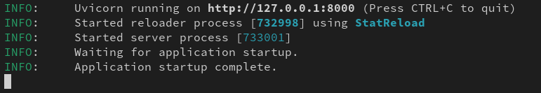
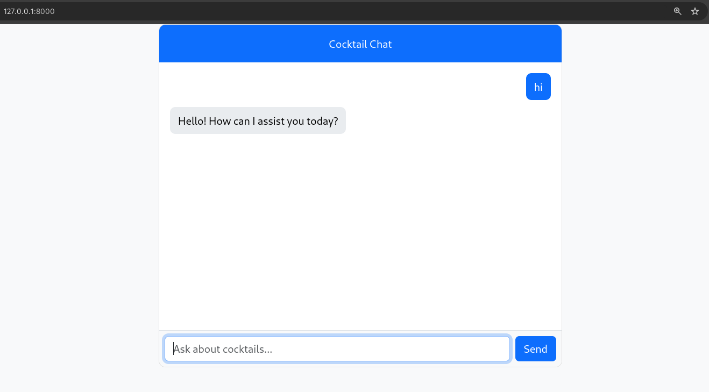

# Cocktail Advisor Chat

## Installation and launch

1. Clone repositories:

   Via HTTP
   ```bash
   git clone https://github.com/k0drin/Cocktail-Advisor-Chat.git
   ```

   Via SSH
   ```bash
   git clone git@github.com:k0drin/Cocktail-Advisor-Chat.git
   ```
2. Install the virtual environment and activate it:
   ```bash
    python3 -m venv venv
    source venv/bin/activate  # For Windows, use `venv\Scripts\activate`
    ```
3. Install all dependencies:
   ```bash
    pip install -r requirements.txt
    ```

4. To start in development environment:
    ```bash
    uvicorn chat:app --reload
    ```
   And for production:
    ```bash
    uvicorn chat:app --host 0.0.0.0 --port 8000 
    ```

5. If the previous steps were performed correctly, you will see:

    

6. And now after switching to localhost you can start chatting:

    


    